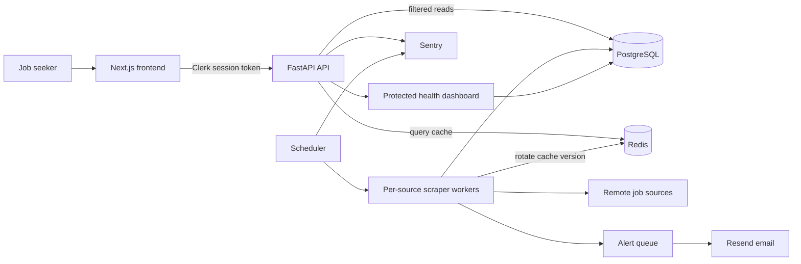

# Rozgar architecture

The API is the authorization boundary. The frontend gets a short-lived Clerk session
token and sends it as a bearer token; FastAPI verifies its signature, issuer, expiry,
and authorized party before deriving the user ID. Saved-search recipients come from
Clerk's verified primary email rather than browser input.

PostgreSQL is the system of record. Redis only caches serialized job-query responses,
so cache failure falls back to PostgreSQL. Job writes rotate a shared cache version.
The scheduler runs sources independently and PostgreSQL advisory locks stop concurrent
workers from duplicating a source run or alert delivery.

Alert work is stored before an external send. Each search/job pair is unique, retries
reuse a stable Resend idempotency key, and ambiguous sends older than the provider's
idempotency window move to `needs_review` rather than risking duplicate email.

Sentry captures unexpected frontend, API, scheduler, scraper, and alert failures.
The event scrubbers remove user identity, headers, cookies, request bodies, query text,
breadcrumbs, and local variables. The protected `/health` dashboard shows source
freshness and alert queue state without exposing raw errors or credentials.
